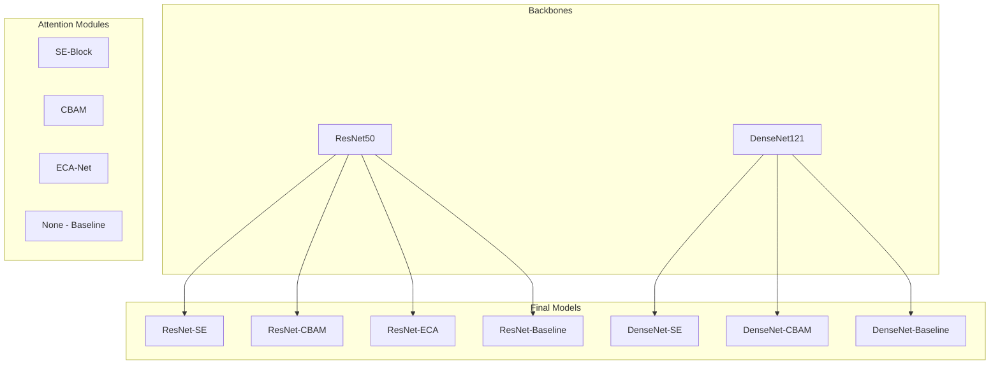
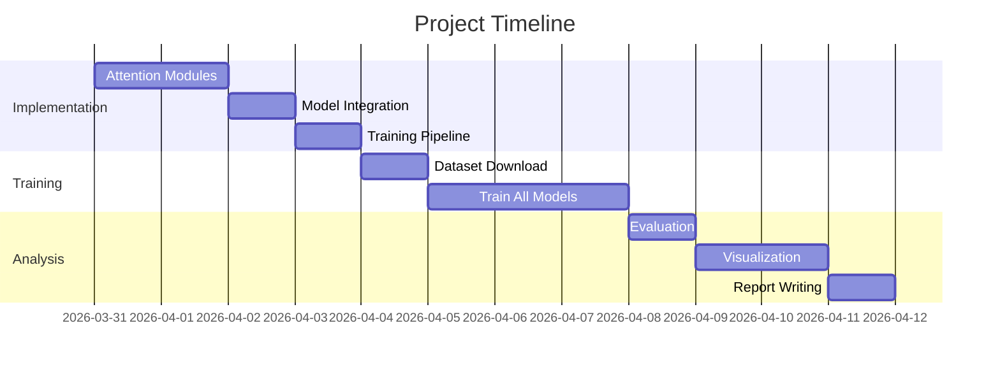

# Attention-Enhanced CNN for Chest X-Ray Classification

## 🎯 Project Overview

**Mục tiêu:** Áp dụng attention mechanisms lên CNN backbone để tăng hiệu quả phân loại bệnh từ ảnh X-quang ngực, đặc biệt cải thiện độ nhạy (sensitivity) đối với lao phổi (Tuberculosis).

---

## 📋 Problem Statement

### Current Issues
- Model hiện tại chỉ phân loại 2 classes (Normal/Pneumonia)
- Tuberculosis (TB) là bệnh nguy hiểm cần phát hiện sớm
- TB sensitivity thấp có thể dẫn đến false negatives → bỏ sót bệnh
- CNN truyền thống có thể bỏ qua features quan trọng ở vùng nhỏ

### Proposed Solution
- Thêm **attention modules** vào CNN backbone
- Tập trung vào features quan trọng cho từng class
- Cải thiện TB sensitivity mà không giảm overall accuracy

---

## 🏗️ Architecture Design

### Backbone Options



### Model Variants

| Model ID | Backbone | Attention | Parameters | Expected TB Sensitivity |
|----------|----------|-----------|------------|------------------------|
| M1 | ResNet50 | None (Baseline) | 25.6M | 0.75-0.80 |
| M2 | ResNet50 | SE-Block | 28.1M | 0.80-0.85 |
| M3 | ResNet50 | CBAM | 28.5M | 0.82-0.87 |
| M4 | ResNet50 | ECA-Net | 26.2M | 0.78-0.83 |
| M5 | DenseNet121 | None (Baseline) | 8.0M | 0.73-0.78 |
| M6 | DenseNet121 | SE-Block | 8.9M | 0.78-0.83 |
| M7 | DenseNet121 | CBAM | 9.2M | 0.80-0.85 |

---

## 🔬 Attention Modules

### 1. SE-Block (Squeeze-and-Excitation)

```python
class SEBlock(nn.Module):
    """
    Squeeze-and-Excitation Block
    
    Architecture:
    1. Squeeze: Global Average Pooling → [B, C, 1, 1]
    2. Excitation: FC → ReLU → FC → Sigmoid
    3. Scale: Multiply original features
    """
    def __init__(self, channels, reduction=16):
        super().__init__()
        self.avg_pool = nn.AdaptiveAvgPool2d(1)
        self.fc = nn.Sequential(
            nn.Linear(channels, channels // reduction),
            nn.ReLU(inplace=True),
            nn.Linear(channels // reduction, channels),
            nn.Sigmoid()
        )
    
    def forward(self, x):
        b, c, _, _ = x.size()
        y = self.avg_pool(x).view(b, c)
        y = self.fc(y).view(b, c, 1, 1)
        return x * y.expand_as(x)
```

**Pros:**
- ✅ Simple, easy to implement
- ✅ Low computational overhead
- ✅ Effective channel weighting

**Cons:**
- ❌ No spatial attention
- ❌ Dimension reduction may lose information

---

### 2. CBAM (Convolutional Block Attention Module)

```python
class CBAM(nn.Module):
    """
    Convolutional Block Attention Module
    
    Architecture:
    1. Channel Attention Module (CAM)
    2. Spatial Attention Module (SAM)
    3. Sequential application
    """
    def __init__(self, channels, reduction=16):
        super().__init__()
        # Channel Attention
        self.avg_pool = nn.AdaptiveAvgPool2d(1)
        self.max_pool = nn.AdaptiveMaxPool2d(1)
        self.channel_fc = nn.Sequential(...)
        
        # Spatial Attention
        self.spatial_conv = nn.Conv2d(2, 1, kernel_size=7, padding=3)
    
    def forward(self, x):
        x = self.channel_attention(x) * x
        x = self.spatial_attention(x) * x
        return x
```

**Pros:**
- ✅ Both channel AND spatial attention
- ✅ Better feature localization
- ✅ Expected best for TB detection

**Cons:**
- ❌ More parameters than SE
- ❌ Slightly slower inference

---

### 3. ECA-Net (Efficient Channel Attention)

```python
class ECA(nn.Module):
    """
    Efficient Channel Attention
    
    Architecture:
    1. Global Average Pooling
    2. 1D Convolution with adaptive kernel
    3. Sigmoid activation
    """
    def __init__(self, channels, gamma=2, b=1):
        super().__init__()
        kernel_size = int(abs((math.log2(channels) + b) / gamma))
        self.conv = nn.Conv1d(1, 1, kernel_size=kernel_size, 
                              padding=kernel_size//2, bias=False)
        self.sigmoid = nn.Sigmoid()
    
    def forward(self, x):
        y = x.mean(dim=[2,3], keepdim=True)
        y = self.conv(y.squeeze(-1).transpose(-1,-2)).transpose(-1,-2).unsqueeze(-1)
        return x * self.sigmoid(y)
```

**Pros:**
- ✅ No dimension reduction
- ✅ Very efficient (minimal overhead)
- ✅ Adaptive kernel size

**Cons:**
- ❌ Only channel attention
- ❌ May be too simple for complex patterns

---

## 📊 Dataset

### Primary Dataset

**Source:** Kaggle - Chest X-Ray (Pneumonia, Covid-19, Tuberculosis)
**URL:** https://www.kaggle.com/datasets/jtiptj/chest-xray-pneumoniacovid19tuberculosis

| Class | Train | Validation | Test | Total |
|-------|-------|------------|------|-------|
| Normal | ~1,200 | ~350 | ~150 | ~1,700 |
| Pneumonia | ~2,000 | ~600 | ~250 | ~2,850 |
| Tuberculosis | ~1,500 | ~450 | ~200 | ~2,150 |
| COVID-19 | ~1,800 | ~550 | ~230 | ~2,580 |
| **Total** | **~6,500** | **~1,950** | **~830** | **~9,280** |

**Image Properties:**
- Format: PNG/JPEG
- Size: Variable (resized to 224x224)
- Color: RGB (grayscale X-ray converted to 3 channels)

### Data Augmentation

```python
train_transform = transforms.Compose([
    transforms.Resize((224, 224)),
    transforms.RandomHorizontalFlip(p=0.5),
    transforms.RandomVerticalFlip(p=0.5),
    transforms.RandomRotation(degrees=15),
    transforms.ColorJitter(brightness=0.2, contrast=0.2),
    transforms.RandomAffine(degrees=0, translate=(0.1, 0.1)),
    transforms.ToTensor(),
    transforms.Normalize(mean=[0.485, 0.456, 0.406], 
                        std=[0.229, 0.224, 0.225]),
])
```

---

## 🎯 Evaluation Metrics

### Primary Metrics

| Metric | Formula | Priority | Target |
|--------|---------|----------|--------|
| **TB Sensitivity** | TP_TB / (TP_TB + FN_TB) | ⭐⭐⭐ | > 0.85 |
| Overall Accuracy | (TP+TN) / Total | ⭐⭐ | > 0.90 |
| Macro F1-Score | Mean(F1 per class) | ⭐⭐ | > 0.88 |
| TB F1-Score | 2*(Prec_TB*Recall_TB)/(Prec+Recall) | ⭐⭐⭐ | > 0.85 |

### Secondary Metrics

```python
- Precision per class
- Specificity per class
- ROC-AUC (One-vs-Rest)
- PR-AUC (Precision-Recall)
- Confusion Matrix
- Cohen's Kappa
```

### Model Efficiency

```python
- Parameters count (M)
- Model size (MB)
- Inference time (ms/img)
- FLOPs (G)
```

---

## 🧪 Experimental Setup

### Training Configuration

```yaml
# configs/experiment_config.yaml
training:
  epochs: 50
  batch_size: 32
  learning_rate: 1.0e-4
  weight_decay: 1.0e-4
  optimizer: AdamW
  scheduler: CosineAnnealingLR
  scheduler_params:
    T_max: 50
    eta_min: 1.0e-6
  
  img_size: 224
  num_workers: 4
  pin_memory: true
  mixed_precision: true
  
  early_stopping:
    patience: 10
    min_delta: 0.001
  
  class_weights: true  # Handle imbalanced data
  
  seed: 42
  deterministic: true
```

### Hardware Requirements

| Component | Minimum | Recommended |
|-----------|---------|-------------|
| GPU | GTX 1060 (6GB) | RTX 3090 (24GB) |
| RAM | 16 GB | 32 GB |
| Storage | 50 GB SSD | 100 GB NVMe |
| Training Time (all models) | ~12 hours | ~4 hours |

---

## 📈 Analysis Plan

### 1. Performance Comparison

```python
# Compare all models on test set
models = ['ResNet50', 'ResNet50-SE', 'ResNet50-CBAM', 
          'ResNet50-ECA', 'DenseNet121', 'DenseNet121-SE', 
          'DenseNet121-CBAM']

metrics = ['accuracy', 'precision', 'recall', 'f1', 
           'tb_sensitivity', 'tb_specificity']

# Statistical tests
- Paired t-test (Baseline vs Attention)
- ANOVA (multiple models)
- Post-hoc Tukey HSD
```

### 2. TB Sensitivity Analysis

```python
# Focus on Tuberculosis class
- Sensitivity comparison
- False Negative Rate analysis
- Precision-Recall curve for TB
- Confusion matrix (focus on TB row)
```

### 3. Visualization

```python
# Training curves
- Loss curves (train/val)
- Accuracy curves
- Learning rate schedule

# Model comparison
- Bar chart: TB sensitivity by model
- Heatmap: Confusion matrices
- ROC curves overlay
- PR curves overlay

# Attention visualization
- Grad-CAM heatmaps
- Attention maps overlay on X-ray
- Feature map visualization
```

---

## 📁 Project Structure

```
chest-xray-disease-classifier/
├── docs/
│   ├── ATTENTION_DESIGN.md          # This file
│   ├── EXPERIMENT_PLAN.md           # Detailed experiment steps
│   └── RESULTS_ANALYSIS.md          # Results & conclusions
│
├── src/classifier/
│   ├── models/
│   │   ├── model.py                 # Existing models
│   │   ├── attention.py             # ⭐ Attention modules
│   │   └── attention_models.py      # ⭐ Models with attention
│   └── utils/
│       ├── training.py              # Training utilities
│       ├── compare.py               # ⭐ Model comparison
│       └── visualize.py             # ⭐ Visualization utils
│
├── configs/
│   ├── attention_config.yaml        # Attention module configs
│   └── experiment_config.yaml       # Training configs
│
├── scripts/
│   ├── train_all_models.sh          # ⭐ Train all 7 models
│   ├── evaluate_models.py           # ⭐ Evaluate on test set
│   ├── compare_results.py           # ⭐ Statistical comparison
│   └── visualize_attention.py       # ⭐ Grad-CAM visualization
│
├── notebooks/
│   ├── 01_data_exploration.ipynb
│   ├── 02_attention_comparison.ipynb
│   └── 03_tb_sensitivity_analysis.ipynb
│
├── results/
│   ├── models/                      # Saved checkpoints
│   ├── metrics/                     # CSV/JSON metrics
│   └── figures/                     # Plots & visualizations
│
├── train.py                         # Updated with attention support
├── compare_models.py                # ⭐ Main comparison script
└── README_attention.md              # ⭐ Study documentation
```

---

## 📝 Hypotheses

| ID | Hypothesis | Expected Outcome |
|----|------------|------------------|
| H1 | Attention models > Baseline | +3-5% accuracy |
| H2 | CBAM > SE > ECA | CBAM best for TB |
| H3 | Attention improves TB sensitivity | +5-10% recall for TB |
| H4 | DenseNet+Attention > ResNet+Attention | Better feature reuse |
| H5 | Overhead acceptable | <10% slower inference |

---

## ⏱️ Timeline



---

## ✅ Success Criteria

- [ ] All 7 models trained successfully
- [ ] TB sensitivity > 0.85 for best model
- [ ] Overall accuracy > 0.90
- [ ] Statistical significance (p < 0.05)
- [ ] Grad-CAM visualization shows attention on lung regions
- [ ] Report with clear conclusions
- [ ] HF Space demo with best model

---

## 🔗 References

1. **SE-Net:** Hu et al. "Squeeze-and-Excitation Networks" (CVPR 2018)
2. **CBAM:** Woo et al. "CBAM: Convolutional Block Attention Module" (ECCV 2018)
3. **ECA-Net:** Wang et al. "ECA-Net: Efficient Channel Attention" (CVPR 2020)
4. **ResNet:** He et al. "Deep Residual Learning" (CVPR 2016)
5. **DenseNet:** Huang et al. "Densely Connected Convolutional Networks" (CVPR 2017)

---

## 📌 Notes

- Class imbalance là vấn đề chính → dùng class weights
- TB có thể có features nhỏ → spatial attention (CBAM) quan trọng
- Cần early stopping để tránh overfitting
- Grad-CAM giúp giải thích model decisions

---

**Next Steps:** See [[ATTENTION_TODO]] for detailed task list
